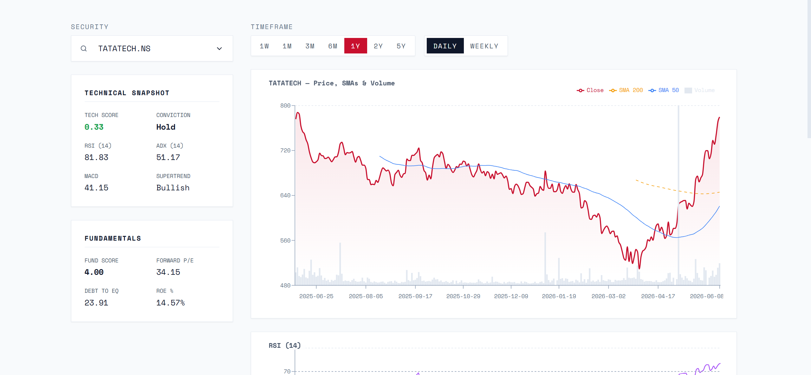

<div align="center">
  
  <h1>Quantitative Alpha</h1>
  <p><strong>A research-backed quantitative stock recommendation system for the National Stock Exchange of India.</strong></p>
  <p>Engineered for the Alpha Research and Investment Club, FMS Delhi.</p>
</div>

<br />

<div align="center">
  
</div>

<br />

## Goal and Impact

Quantitative Alpha is a fully automated stock screening and recommendation platform that evaluates the top 150 liquid equities on the National Stock Exchange of India (NSE) using a multi-factor model grounded in published academic research. The system eliminates emotional bias from equity research by applying systematic, rules-based scoring across three dimensions: technical momentum, fundamental quality, and research-backed quantitative factors.

The platform generates daily recommendations with conviction ratings (Strong Buy, Buy, Hold, Caution, Avoid) and stores all data in a growing SQLite database that accumulates daily feature vectors and forward return outcomes -- forming the foundation for future machine learning model training.

## How It Works

The system operates as a dual-mode pipeline: a heavy batch scan runs three times daily via GitHub Actions, while a lightweight live updater polls prices every 3 minutes during market hours via Vercel serverless functions.

### Batch Scan Pipeline (scanner.py)

1. **Universe Selection**: Downloads the NSE Bhav Copy (official end-of-day data) and selects the top 150 stocks by turnover.
2. **OHLCV Fetching**: Downloads 2 years of daily OHLCV data per stock via yfinance with retry logic and concurrency control (4 workers).
3. **Technical Indicator Computation**: Computes 18+ indicators per stock using Wilder's smoothing method for RSI, ATR, and ADX.
4. **Fundamental Data Collection**: Fetches P/E, ROE, Debt-to-Equity, market cap, and other fundamentals from yfinance and screener.in. Computes sector-relative medians for peer comparison.
5. **Research Factor Computation**: Calculates six academic research factors: Piotroski F-Score, Gross Profitability, Multi-Horizon Momentum, Low Volatility, Mean Reversion, and Earnings Quality.
6. **News Sentiment**: Fetches headlines from Google News RSS (India-aware, no API key required) and runs VADER sentiment analysis on each headline. Average compound score is used as the news sentiment signal.
7. **Scoring and Conviction**: Combines all factors into a composite score, ranks stocks by percentile, and assigns conviction labels adjusted for market regime.
8. **Data Storage**: Writes results to `market_data.json` (frontend), `market_scans.db` (ML pipeline), and archives to SQLite.
9. **Outcome Tracking**: Backfills forward returns (5d, 10d, 21d, 63d, 126d, 252d) for all past scans using stored OHLCV data.

### Live Update Pipeline (live_updater.py)

- Polls yfinance every 3 minutes during market hours (9:15 AM -- 3:30 PM IST).
- Updates only Price and 1d Change % in the existing `market_data.json`.
- Writes live price snapshots to the `live_prices` SQLite table.

## Scoring System

### Technical Score (range: -1.0 to +1.0)

A weighted ensemble of 14 binary signals. Each signal outputs +1 (bullish), -1 (bearish), or 0 (neutral). The weighted sum is normalized to produce a single score.

| Signal | Weight | Bullish Condition | Bearish Condition |
|--------|--------|-------------------|-------------------|
| Supertrend | 2.0 | Close above Supertrend line | Close below Supertrend line |
| Price vs SMA 200 | 2.0 | Close > SMA 200 | Close < SMA 200 |
| SMA 50 vs 200 | 2.0 | SMA 50 > SMA 200 (Golden Cross) | SMA 50 < SMA 200 (Death Cross) |
| ADX Trend Strength | 2.0 | ADX > 25 and +DI > -DI | ADX > 25 and -DI > +DI |
| Ichimoku Cloud | 1.5 | Close above both Span A and Span B | Close below both Span A and Span B |
| MACD Crossover | 1.0 | MACD > Signal Line | MACD < Signal Line |
| RSI (14-period) | 1.0 | RSI between 40-80 in bullish regime, or RSI < 30 in bearish | RSI > 70 |
| Volume Price Trend | 1.0 | VPT > 20-EMA of VPT | VPT < 20-EMA of VPT |
| Price vs SMA 50 | 1.0 | Close > SMA 50 | Close < SMA 50 |
| MACD Histogram | 0.5 | Current histogram > Previous histogram | Current histogram < Previous histogram |
| Stochastic Oscillator | 0.25 | %K < 20 and %K > %D | %K > 80 and %K < %D |
| Commodity Channel Index | 0.25 | CCI < -100 | CCI > 100 |
| Bollinger Bands %B | 0.25 | %B < 0.05 | %B > 0.95 |

Relative Strength percentiles provide an additional +/-0.2 adjustment for stocks in the top or bottom quartile.

News sentiment provides an additional +/-1.0 adjustment to the normalized technical score when the average VADER compound score exceeds +/-0.15.

### Fundamental Score (range: 0 to 10)

Evaluates financial quality using sector-relative comparisons. The system dynamically computes sector medians for P/E, ROE, and Debt-to-Equity from the current universe plus screener.in peer data.

| Metric | Max Points | Logic |
|--------|------------|-------|
| ROE | 1.5 | >= 1.5x sector median: 1.5 pts, >= sector median: 0.5 pts |
| ROCE | 1.5 | >= 20%: 1.5 pts, >= 12%: 0.5 pts |
| PEG Ratio | 2.0 | PEG < 1.0: 2.0 pts, PEG < 1.5: 1.0 pts (requires positive EPS growth) |
| Debt-to-Equity | 1.5 | < 0.8x sector median: 1.5 pts, < sector median: 0.5 pts |
| EPS Growth | 1.5 | > 15% YoY |
| Revenue Growth | 1.0 | > 10% YoY |
| Dividend Yield | 0.5 | > 1.0% |
| Market Cap | 1.0 | > INR 10 billion |
| Sharpe Ratio | 1.0 | > 1.0 |
| Promoter Holding | 1.0 | > 50% holding and < 10% pledging |

Maximum score is capped at 10.0. A penalty of -1.5 is applied for promoter pledging above 30%.

### Research Factor Score (range: 0 to 10)

Six academic factors, each normalized to 0-10 and combined with research-derived weights:

| Factor | Weight | Paper | Range |
|--------|--------|-------|-------|
| Piotroski F-Score | 0.15 | Piotroski (2000) | 0-9 mapped to 0-10 |
| Gross Profitability | 0.15 | Novy-Marx (2013) | 0-10 |
| Momentum Composite | 0.25 | Jegadeesh & Titman (1993) | -0.5 to +1.0 mapped to 0-10 |
| Low Volatility | 0.15 | Baker, Bradley & Wurgler (2011) | 0-10 (lower vol = higher score) |
| Mean Reversion | 0.10 | De Bondt & Thaler (1985) | 0-10 (oversold = higher score) |
| Earnings Quality | 0.10 | Sloan (1996) | 0-10 |

### Composite Score and Conviction

The composite score blends all three dimensions with configurable weights:

| Variant | Tech | Fund | Research |
|---------|------|------|----------|
| Default | 0.35 | 0.30 | 0.35 |
| Tech-heavy | 0.50 | 0.15 | 0.35 |
| Fund-heavy | 0.15 | 0.55 | 0.30 |
| Momentum | 0.30 | 0.20 | 0.50 |

Stocks are ranked by composite percentile across the universe. Conviction labels are assigned and adjusted for market regime:

- Strong Buy: >= 90th percentile (or >= 85th in bullish regime)
- Buy: >= 70th percentile
- Hold: >= 40th percentile
- Caution: >= 20th percentile
- Avoid: < 20th percentile

Market regime adjustments downgrade conviction levels when the regime score is <= -2 (deep bear) or mildly bearish (-1).

## Market Regime Detection

A composite regime score ranging from -3 to +3 is computed from:

1. Nifty 50 position relative to its 200-day SMA (+1 or -1)
2. India VIX level: < 15 (+1), > 25 (-1)
3. Market breadth (advances / total): > 0.55 (+1), < 0.45 (-1)

## Technical Indicators

All indicators are computed using Wilder's exponential smoothing method (not standard pandas EWM) for accuracy:

- **RSI (14)**: Wilder-smoothed relative strength index
- **MACD**: EMA(12) - EMA(26), with 9-period signal line
- **Bollinger Bands**: 20-period SMA +/- 2 standard deviations
- **Stochastic Oscillator**: 14-period %K and 3-period %D
- **ATR (14)**: Average True Range with Wilder's smoothing
- **ADX (14)**: Average Directional Index with +DI/-DI lines
- **Supertrend**: 10-period, 3x multiplier
- **Weekly Supertrend**: Resampled weekly Supertrend direction mapped to daily data
- **VPT**: Volume Price Trend with 20-period EMA
- **Ichimoku Cloud**: Tenkan (9), Kijun (26), Span A, Span B (52)
- **CCI (20)**: Commodity Channel Index
- **VOL_MA20**: 20-day volume moving average

## Data Storage

All data is stored in `data/market_scans.db` (SQLite) with the following tables:

| Table | Purpose | Growth Rate |
|-------|---------|-------------|
| `daily_ohlcv` | Raw OHLCV data per stock per day | ~70,000 rows per scan |
| `factor_history` | 62-column feature matrix per stock per scan | 149 rows per scan |
| `outcome_tracking` | Forward returns at 5d/10d/21d/63d/126d/252d | 149 rows per scan |
| `regime_history` | Market regime, Nifty level, breadth | 1 row per scan |
| `scan_summary` | Duration, coverage, top/bottom stocks | 1 row per scan |
| `historical_scans` | Full scan results with all 78 fields | 149 rows per scan |
| `live_prices` | Intraday price snapshots | ~149 rows per 3 minutes |

Outcome tracking automatically backfills forward returns for all past scans on each new run, creating a growing training dataset for machine learning.

## Machine Learning Query Functions

The `data_pipeline.py` module provides ready-to-use functions for ML workflows:

- `get_ml_dataset(min_date, max_date)` -- Full feature+label DataFrame for model training
- `get_stock_timeseries(ticker)` -- Per-stock factor history over time
- `get_regime_timeseries()` -- Market regime evolution
- `get_outcome_accuracy(min_date)` -- Win rate and average return by conviction level

## Architecture

```text
+-------------------------------------------------------------------------+
|                              DATA PIPELINE                              |
+-------------------------------------------------------------------------+
|  [nse_fetcher.py]                                                       |
|  1. Fetches top 150 NSE liquid stocks by turnover                      |
|         |                                                               |
|         v                                                               |
|  [scanner.py] (Main Orchestrator)                                       |
|  2. Downloads 2y OHLCV via yfinance (4 workers, retry logic)           |
|  3. Fetches fundamentals from yfinance + screener.in                    |
|         |                                                               |
|         +--> [indicators.py]                                            |
|         |    18+ indicators using Wilder's smoothing                    |
|         |                                                               |
|         +--> [recommendation.py]                                        |
|         |    Tech Score (-1 to +1), Fund Score (0-10), Conviction       |
|         |                                                               |
|         +--> [research_factors.py]                                      |
|         |    Piotroski, Gross Profit, Momentum, Volatility,             |
|         |    Mean Reversion, Earnings Quality                           |
|         |                                                               |
|         +--> [data_pipeline.py]                                         |
|              ML-ready storage: OHLCV, factors, outcomes, regime         |
|                                                                         |
|  4. News Sentiment:                                                     |
|     - Google News RSS (India-aware, no API key)                         |
|     - VADER sentiment analysis on headlines                             |
|                                                                         |
|  5. Outputs to:                                                         |
|     - market_data.json (frontend)                                       |
|     - market_scans.db (ML pipeline)                                     |
+-------------------------------------------------------------------------+
```

## Dashboard Features

The React frontend is a five-tab analytical dashboard:

| Tab | Description |
|-----|-------------|
| **Signals** | Top 3 high-conviction picks for Short-Term (momentum) or Long-Term (value) horizon. Each card shows a composite score, a radar chart across Tech / Fund / Research / Momentum / Piotroski axes, and six key metrics. |
| **Screen** | Full universe screener with sortable columns (Ticker, Sector, LTP, 1D%, Composite, Tech, Fund, Research, F-Score, 12M Momentum, P/E, D/E, Conviction). Dynamic filters for composite score, Piotroski F-Score, sector, conviction, market cap, and D/E ratio. Expandable row shows all 14 technical signals and 12 research factors. |
| **Charts** | Interactive charting for any stock: Price + SMA 50/200 + Supertrend overlay, RSI (14) with 30/50/70 reference lines, MACD (12,26,9) with color-coded histogram. Left panel shows company profile, technicals, research factors, momentum, fundamentals, and risk metrics. Sector peer comparison table below. Supports 7 periods (1W-5Y) and daily/weekly interval. |
| **Heatmap** | Color-coded sector heatmap where each tile represents a stock, colored from red (low composite) to green (high composite). Sectors sorted alphabetically. Color legend shown. |
| **Factor Lab** | Conviction accuracy tracker that shows historical win rates and average forward returns (21D and 63D) by conviction level, with a bar chart and summary cards. Data accumulates as scans age. |

### Market Regime Strip

A compact status strip below the header shows the current market regime (Bullish / Neutral / Bearish) with a color-coded left border, alongside live NIFTY change %, India VIX, and market breadth.

## Tech Stack

- **Frontend**: React 19, Vite 8, Tailwind CSS 3, Recharts 3, Lucide Icons
- **Data Engine**: Python 3.12, pandas, numpy, yfinance, BeautifulSoup, vaderSentiment, feedparser
- **News Source**: Google News RSS (India-aware, no API key required)
- **Serverless API**: Vercel Functions (`api/chart.ts`, `api/live_data.ts`) -- live pricing + chart indicator computation
- **Database**: SQLite (`market_scans.db`)
- **CI/CD**: GitHub Actions (three times daily: pre-open, mid-day, post-market scans)
- **Deployment**: Vercel (frontend + serverless), GitHub (data + backend)

### Frontend Component Map

```text
frontend/src/
├── App.tsx               # Global state, routing, data fetch, tab orchestration
├── types.ts              # TypeScript interfaces (DashboardData, MarketData, etc.)
├── index.css             # Design tokens, dark mode, glassmorphism utilities
└── components/
    ├── shared.tsx         # num(), colorCode(), scoreBar(), SortHeader()
    ├── SignalsTab.tsx      # High conviction signal cards with radar chart
    ├── ScreenerTab.tsx     # Full universe screener with filters + expandable rows
    ├── ChartingTab.tsx     # Price/RSI/MACD charts + company profile panel
    ├── HeatmapTab.tsx      # Sector heatmap with color legend
    └── FactorLabTab.tsx    # Conviction accuracy tracker with forward return charts
```

## Local Setup

### Prerequisites

- Python 3.12+
- Node.js 18+
- Git

### 1. Clone and Install

```bash
git clone https://github.com/abhy-kumar/quant-alpha.git
cd quant-alpha

# Python environment
python -m venv .venv
# Windows
.\.venv\Scripts\activate
# Unix/MacOS
source .venv/bin/activate

pip install -r requirements.txt

# Frontend
cd frontend
npm install
cd ..
```

### 2. Run the Scanner

```bash
python scanner.py
```

This downloads data for ~150 stocks (takes 2-3 minutes), computes all indicators and scores, and generates `frontend/public/market_data.json`.

### 3. Launch the Frontend

```bash
cd frontend
npm run dev
```

Navigate to `http://localhost:5173`.

### 4. (Optional) Run Tests

```bash
python -m unittest discover tests/ -v
```

## Configuration

All tunable parameters are in `config.py`:

| Parameter | Default | Description |
|-----------|---------|-------------|
| PERIOD | 2y | OHLCV history period |
| INTERVAL | 1d | OHLCV candle interval |
| MIN_ROWS | 50 | Minimum data rows per stock |
| MAX_WORKERS_OHLCV | 4 | Concurrent OHLCV download threads |
| MAX_WORKERS_FUNDAMENTALS | 2 | Concurrent fundamental fetch threads |
| CACHE_TTL_FUNDAMENTALS | 30 days | Fundamental data cache duration |
| CACHE_TTL_NEWS | 24 hours | News sentiment cache duration |
| RISK_FREE_RATE | 0.065 | Risk-free rate for Sharpe ratio (India 10Y G-Sec) |

## Project Structure

```text
stock-dashboard/
├── config.py                   # Configuration constants
├── scanner.py                  # Main orchestrator (batch scan)
├── indicators.py               # Technical indicator computations
├── recommendation.py           # Scoring models and conviction logic
├── research_factors.py         # Academic research factor implementations
├── data_pipeline.py            # ML-ready data storage layer
├── nse_fetcher.py              # NSE data sources (Bhav Copy, live quotes)
├── live_updater.py             # Intraday price updater
├── scheduler.py                # APScheduler background jobs
├── utils.py                    # Shared utilities and caching
├── populate_cache.py           # Cache pre-population script
├── populate_ath.py             # All-time high pre-population
├── requirements.txt            # Python dependencies
├── data/
│   ├── market_scans.db         # SQLite database (ML training data)
│   ├── sector_cache.json       # Sector/industry mappings
│   ├── fundamentals_cache.json # yfinance fundamental data cache
│   ├── news_cache.json         # VADER sentiment cache
│   ├── ath_cache.json          # All-time high cache
│   └── etf_list.json           # ETF exclusion list
├── frontend/
│   ├── api/
│   │   ├── chart.ts            # Vercel serverless: charting endpoint
│   │   └── live_data.ts        # Vercel serverless: live pricing
│   ├── public/
│   │   └── market_data.json    # Generated scan output
│   ├── src/
│   │   ├── App.tsx             # Main dashboard application
│   │   ├── main.tsx            # React entry point
│   │   ├── types.ts            # TypeScript interfaces
│   │   └── components/         # Dashboard tab components
│   ├── package.json
│   └── vite.config.ts
├── .github/
│   └── workflows/
│       └── daily_scan.yml      # GitHub Actions: three-times-daily scan
├── tests/
│   ├── test_indicators.py      # Indicator unit tests
│   ├── test_scoring.py         # Scoring function tests
│   └── test_research_factors.py # Research factor tests
└── assets/                     # Logos and preview images
```

## GitHub Actions

The scanner runs automatically three times daily via GitHub Actions:

| Schedule | IST Time | Purpose |
|----------|----------|---------|
| 03:30 UTC Mon-Fri | 9:00 AM IST | Pre-open scan (fresh data before market opens) |
| 07:00 UTC Mon-Fri | 12:30 PM IST | Mid-day snapshot |
| 10:45 UTC Mon-Fri | 4:15 PM IST | Post-market scan (end-of-day signals, primary run) |

Each run pulls the latest database, runs the scanner, and commits the updated `market_data.json` and `market_scans.db` back to the repository.

## Disclaimer

This platform is provided strictly for educational and academic research purposes. It does not constitute, and should not be construed as, investment advice, a solicitation, or a recommendation to buy, sell, or hold any security or financial instrument.

The quantitative models, scoring systems, signals, and conviction ratings generated by this platform are experimental in nature and have not been validated by any regulatory authority. They are based on historical data and academic research, and past performance is not indicative of future results. All investments carry risk, including the potential loss of principal.

No representation or warranty is made as to the accuracy, completeness, or timeliness of the data, computations, or outputs provided by this platform. The developers and contributors assume no obligation to update any information and shall not be held liable for any errors, omissions, or inaccuracies in the data or analysis.

Users should conduct their own due diligence and consult a SEBI-registered investment advisor or certified financial planner before making any investment decisions. Alpha Research and Investment Club, FMS Delhi, and its members accept no responsibility or liability for any losses, damages, or costs arising from the use of or reliance on this platform.

By using this platform, you acknowledge that you have read, understood, and agreed to this disclaimer.

---

Developed by Abhishek Kumar
