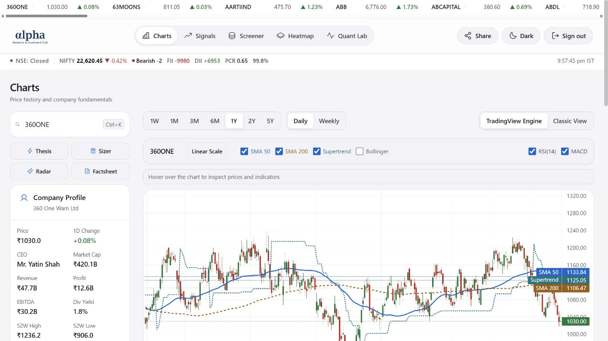

<div align="center">
  
  <p><strong>NSE stock screening, factor research, and portfolio analysis.</strong></p>
  <p>Built for the Alpha Research & Investment Club, Faculty of Management Studies (FMS), University of Delhi.</p>
</div>

[](https://github.com/abhy-kumar/quant-alpha/actions/workflows/daily_scan.yml)
[](https://github.com/abhy-kumar/quant-alpha/actions/workflows/checks.yml)
[](https://www.python.org/)
[](https://react.dev/)
[](https://www.typescriptlang.org/)

[Open the dashboard](https://quant-alpha-sage.vercel.app) · [Market data API](https://quant-alpha-sage.vercel.app/api/data?resource=market)



## What the platform does

Quant Alpha combines NSE price data, financial statements, technical indicators,
and recorded factor snapshots. It provides charts, a stock screener, a sector
heatmap, research signals, and Quant Lab portfolio tools. It is for educational
research, not investment advice.

- **Scoring and signals:** sector-relative value, quality, momentum, and volatility
  factors; forensic warnings; ATR trade-plan and position-sizing tools.
- **Charts:** daily and weekly price history, technical indicators, and live quotes.
  Quotes refresh every 30 seconds during trading hours and every five minutes when
  closed, using stable cached requests and the NSE holiday calendar.
- **Portfolio analysis:** Max Sharpe, minimum volatility, risk parity, measured
  efficient-frontier estimates, correlations, and factor information coefficients.
- **Backtest studio:** short/long price-factor proxies across 1Y and 6M windows,
  with NIFTY benchmark prices, shares held between rebalances, turnover costs,
  and close-triggered stops that include gap losses.
- **Strategy builder:** recorded factor-snapshot replay with presets, selected
  weighting rules, ATR stops, take-profit exits, and trade logs. No matching stocks
  means cash; unavailable historical periods are not synthesized.
- **Shared research account:** server-validated sessions for Signals and Quant Lab.
  Charts and the public screener remain available without signing in.

The newsletter has been removed.

## Interface and design system

Every screen shares native system typography, neutral surfaces, semantic colors,
consistent controls, and responsive layouts. Light and dark themes use the same
hierarchy. Navigation uses restrained translucent material; research cards use
opaque surfaces. Dialogs support keyboard focus, Escape dismissal, and focus
restoration. The app respects reduced motion and transparency preferences.

See [the design rules and audit](frontend/DESIGN.md) before adding UI components.
The market strip includes every tracked stock. Interface copy uses plain language
without decorative separators, and the footer keeps attribution and the research
disclaimer without repeating the main navigation.
Unavailable research scores are marked N/A. Debt/equity values are displayed as
multiples, converting the source percentage consistently across the app.

## Research methodology and limits

The versioned ranking combines quality, value, momentum, trend and stability.
Short- and long-term scores have explicit weights, sector comparisons and data
coverage requirements. Financial companies use suitable accounting measures.
Signals and Screener use the same horizon-specific score and recommendation.
The top picks can be empty when no stock qualifies.

The universe is selected by traded value, not alphabetically. Every new daily
recommendation retains its model version, inputs and coverage in an immutable
history. Old ML probabilities are not reused for the new model.

See [the full ranking specification and validation](docs/RANKING.md), including
the chronological comparison against ridge regression and gradient boosting.
The weights are a documented starting specification; optimality is not claimed.
Longer outcomes continue to mature after the 21-session outcome is filled. Missing
outcomes do not count as losses. Factor IC uses daily cross-sectional Spearman
correlations over a calendar quarter; insufficient samples display N/A.

The archived factor history currently begins in June 2026. Price-factor backtests
are proxies, not historical replays of today's fundamental model. The recorded
universe is not a complete historical index-constituent database. Missing benchmark
coverage or held-stock execution prices cannot produce invented returns. The
sandbox charges 20 basis points per trade leg and liquidates/re-enters at scheduled
rebalances. Macro stress cards use explicit illustrative shock assumptions.
Portfolio estimates and simulations are research tools, not forecasts.

## Local setup

Use Python 3.12 and Node.js 24. Run Python commands through the virtual environment.
The examples below use Windows PowerShell; on macOS/Linux use `.venv/bin/python`
instead of `.venv/Scripts/python.exe`.

```powershell
git clone https://github.com/abhy-kumar/quant-alpha.git
Set-Location quant-alpha
python -m venv .venv
& .venv/Scripts/python.exe -m pip install -r requirements.txt pytest
& .venv/Scripts/python.exe db_split_join.py join
```

Start the frontend from a second terminal:

```powershell
Set-Location frontend
npm ci
Copy-Item .env.example .env.local
# Fill AUTH_EMAIL and AUTH_PASSWORD in .env.local before signing in.
npm run dev
```

The Vite development server provides the local API endpoints too. Environment
files and the joined database are ignored by Git.

## Validation and data maintenance

From the repository root:

```powershell
& .venv/Scripts/python.exe -m pytest -q
& .venv/Scripts/python.exe -m engine.scanner
```

The scanner makes external data requests and regenerates stored research. To
repair quote gaps and historical outcomes explicitly:

```powershell
& .venv/Scripts/python.exe db_split_join.py join
& .venv/Scripts/python.exe scripts/repair_quote_gaps.py
& .venv/Scripts/python.exe scripts/backfill_research.py
& .venv/Scripts/python.exe db_split_join.py split
```

From `frontend`:

```powershell
npm test
npm run lint
npm run build
```

The build checks the browser TypeScript projects and the standalone function
configuration before building with Vite. Frontend tests cover sessions,
authorization, packaged data paths, pagination, and strategy execution. Type
migration and React performance rules currently produce lint warnings; hook
ordering and other correctness checks remain errors.

### Database chunks

`data/market_scans.db` is local-only. Git tracks 40 MiB chunks named
`data/market_scans.db.part_*`. Join them before running database scripts; checkpoint
SQLite WAL writes before splitting a database that has been modified. Commit only
the parts, never the joined database or its WAL files. Corrected backtest caches
are versioned and invalidated when their source-price fingerprint changes.

An installed local pre-commit hook may split the joined database automatically.
Keep that database current after pulling new parts so the hook cannot replace
fresh parts with an older local copy. Activate the virtual environment before
committing if the hook invokes `python`.

## Deploying on Vercel

Connect this GitHub repository and use these project settings:

| Setting | Value |
| --- | --- |
| Framework | Vite |
| Root directory | `frontend` |
| Build command | `npm run build` |
| Output directory | `dist` |
| Node.js | 24.x |

Configure the server environment variables for each deployment environment used:

| Variable | Purpose |
| --- | --- |
| `AUTH_EMAIL` | Shared account email |
| `AUTH_PASSWORD` | New shared account password |
| `AUTH_SESSION_SECRET` | Optional random signing secret; otherwise derived from the password |

**Do not reuse the historical hardcoded password:** it remains in Git history.
Never prefix credentials with `VITE_`, which exposes values to browser code.
Redeploy after changing environment settings. Without the required login settings,
the shared login fails closed while public charts/screener remain available.

Sessions use signed, HttpOnly, SameSite=Strict cookies, expire after eight hours,
and use Secure cookies in production. Browser local-storage flags do not grant
access. The login throttle is process-local; use Vercel Firewall rate limiting if
distributed enforcement is required.

### Private data packaging and API access

Research JSON is tracked under `frontend/public` for the scan pipeline, but Vite
removes it from the static `dist` output. `vercel.json` includes those datasets in
the data function bundle. The API resolves files relative to its module rather
than `process.cwd()`, accommodating both standalone and repository-root function
mounts. `frontend/api/tsconfig.json` configures Vercel's function compiler, which
does not follow the browser build's TypeScript project references.

| Request | Access |
| --- | --- |
| `/api/data?resource=market` | Public market facts; research fields require a session |
| `/api/data?resource=quant` | Signed-in research account |
| `/api/data?resource=scores` | Signed-in research account |
| `/api/data?resource=strategies` and `&page=N` | Signed-in account; bounded history pages |
| `/api/data?resource=runs` and `resource=run&slug=...` | Signed-in account; versioned backtest archive |
| `/api/chart` and `/api/live_data` | Public; validated parameters |

**A public GitHub repository exposes tracked datasets and historical source.**
The shared login protects hosted API access and views, not copies on GitHub.

If market data returns 503, check the function logs for missing bundled files or
invalid JSON. If the function compiler reports unsupported language-library
methods, check `api/tsconfig.json`; a successful browser build alone does not
validate Vercel's compiler configuration.

## Automation

`.github/workflows/daily_scan.yml` runs weekday scans at approximately 4:07 AM,
9:37 AM, 12:37 PM, 4:11 PM, and 10:07 PM IST, and a Saturday outcome backfill at
9:07 AM IST. GitHub schedules can be delayed. Manual dispatch runs the daily scan
only. Application caches preserve acquisition timestamps across runs, and
concurrency prevents overlapping publications. Scans also refresh recently traded
historical stocks that have left the current screen, keeping research holdings
covered while the exchange's daily file is still pending. If a held stock still
lacks a valid close, that backtest is marked unavailable with the ticker and date;
no partial performance is published or cached, and market data can still update.
Other generation errors fail the job. Generated commits rebase before pushing.
Telegram broadcasting runs after publication using the optional
`TELEGRAM_BOT_TOKEN` and `TELEGRAM_CHAT_ID` GitHub secrets. Manual runs leave
broadcasts off unless the `send_notifications` option is selected.

`.github/workflows/checks.yml` runs Python tests in a virtual environment and
frontend tests, lint, and build checks. It also verifies that research datasets
are absent from the static output.

The 2026 NSE calendar lives in `frontend/server/market_calendar.json` and
`engine/market_calendar.py`. Refresh it from the linked NSE source for later years.

## Code map

| Path | Responsibility |
| --- | --- |
| `data_pipeline/` | Price/fundamental ingestion, SQLite persistence, forward outcomes |
| `engine/` | Scanning, factors, recommendations, ML, portfolios, backtests |
| `engine/strategy_history.py` | Exports recorded factor history for the sandbox |
| `frontend/api/` | Vercel data, chart, quote, and login endpoints |
| `frontend/server/` | Session signing and market calendar |
| `frontend/src/` | React dashboard, charts, screener, and Quant Lab |
| `frontend/tests/` and `tests/` | Frontend and Python regression checks |
| `notifications/` | Telegram signals and weekend research refresh |
| `scripts/` | Quote-gap repair and research backfill |
| `db_split_join.py` | Joins/splits the local SQLite database |

## License and attribution

Developed for the Alpha Research and Investment Club, Faculty of Management
Studies (FMS), University of Delhi. Released under the
[Apache License 2.0 with Commons Clause](LICENSE).
