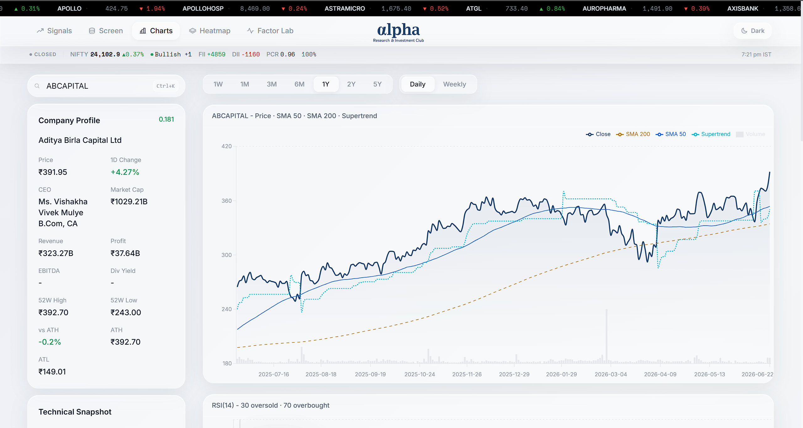

<div align="center">
  
  <br /><br />
  <p><strong>A multi-factor quantitative research and analysis platform for the National Stock Exchange of India.</strong></p>
  <p>Engineered for the Alpha Research and Investment Club, FMS Delhi.</p>

  <br />

  [](https://github.com/abhy-kumar/quant-alpha/actions/workflows/daily_scan.yml)
  [](https://github.com/abhy-kumar/quant-alpha/commits/main)
  [](https://www.python.org/)
  [](https://react.dev/)
  [](./LICENSE)

  <br /><br />

  **[Live Dashboard](https://quant-alpha-sage.vercel.app)**&nbsp;&nbsp;&nbsp;**[Live Data API](https://quant-alpha-sage.vercel.app/api/live_data)**

</div>

<br />

<div align="center">
  
</div>

<br />

## Architecture & System Design

Built to high-throughput, modular software engineering standards (**Jeff Dean & Linus Torvalds** guidelines), Quant Alpha isolates quantitative calculations, ML model fitting, data ingestion, notification pipelines, and UI presentation into distinct packages.

```
stock-dashboard/
├── engine/                      # Quantitative & ML Scoring Pipeline
│   ├── scanner.py               # Main Orchestrator & Execution Entrypoint
│   ├── scoring.py               # Composite & Sector-Neutral Scoring Engine
│   ├── research_factors.py      # Academic Research Factors (Piotroski, Novy-Marx, Fama-French)
│   ├── ml_engine.py             # Walk-Forward Machine Learning Alpha Engine
│   ├── regime_engine.py         # Multi-Factor Macro Market Regime Engine
│   ├── quant_engine.py          # Portfolio Optimizer & Risk Engine
│   ├── recommendation.py        # Technical & Fundamental Signal Engine
│   └── backtest_engine.py       # Vectorized Historical Backtest Engine
│
├── data_pipeline/               # Ingestion & Database Operations
│   ├── nse_fetcher.py           # NSE Bhavcopy Ingestion & Liquid Universe Filter
│   ├── data_fetcher.py          # Financial Statement & yfinance Ingestion
│   ├── data_pipeline.py         # SQLite Schema & Outcome Tracking Engine
│   ├── live_updater.py          # Live Price Overlay & Websocket Feed
│   └── db_split_join.py         # Git 40MB SQLite Database Chunking Utility
│
├── notifications/               # Automated Broadcast & Maintenance
│   ├── telegram_bot.py          # Zero-Cost Telegram Channel Signal Bot
│   ├── weekend_update.py        # Forward Outcome Backfill & Quant Data Refresh
│   └── generate_score_history.py# Historical Score Trend Exporter
│
├── tests/                       # Pytest Backend Unit Test Suite (73 Tests)
├── config.py                    # Global Configuration & System Constants
├── utils.py                     # High-Performance Logging & Helpers
│
└── frontend/src/
    ├── components/
    │   ├── charting/            # TradingView Canvas Chart & Charting Tab
    │   ├── screener/            # Screener Matrix & Stock Comparison Drawer
    │   ├── signals/             # Signals Tab & Conviction Badges
    │   ├── heatmap/             # Sector Treemap & Heatmap Tab
    │   ├── quantlab/            # Interactive Backtest Studio & Factor Weights
    │   └── common/              # Shared macOS UI Primitives & Tooltips
    ├── utils/
    │   └── formatters.ts        # Centralized Formatting & Numeric Utilities
    ├── types.ts                 # TypeScript Type Contracts
    ├── App.tsx                  # Root Container & Router
    └── index.css                # macOS Design System & Typography Scale
```

---

## Key Features

### 1. Machine Learning Walk-Forward Alpha Engine (`ml_engine.py`)
- **Scikit-Learn Ensemble**: Fits a gradient boosted decision tree classifier (`HistGradientBoostingClassifier`) on historical scan outcome records in SQLite (`market_scans.db`).
- **Probability Outperformance ($P(\text{Return}_{21d} > \text{Nifty}_{21d})$)**: Computes real-time outperformance probability and assigns categorical `ML_Conviction` (*Strong Alpha*, *Moderate Alpha*, *Neutral*, *Low Alpha*).

### 2. Sector Neutralized Research Factors (`research_factors.py` & `scoring.py`)
- **Sector Z-Scoring**: Evaluates academic factor metrics (Piotroski F-Score, Novy-Marx Gross Profitability, Fama-French Value, Titman Investment, PEAD SUE, Low Volatility) relative to industry sector medians.
- **Continuous Sigmoid/Tanh Mapping**: Maps factor z-scores via $5.0 + 4.5 \times \tanh(Z / 1.5)$ to eliminate extreme outliers while preserving signal rank granularity.

### 3. Canvas TradingView Engine & Matrix Comparison (`TradingViewChart.tsx` & `ComparisonModal.tsx`)
- **Canvas Rendering**: Powered by `@tradingview/lightweight-charts` with SMA 50/200, Supertrend, Bollinger Bands, RSI, MACD, log/linear price scale toggles, and instant theme update capabilities.
- **Stock Comparison Matrix**: Side-by-side comparative evaluation of up to 4 selected stocks across 20+ technical, fundamental, and quantitative factor dimensions.

### 4. macOS Human Interface Guidelines (Jony Ive Aesthetics)
- **San Francisco Font Hierarchy**: Native macOS font stack (`-apple-system, BlinkMacSystemFont, "SF Pro Display"`) with `font-feature-settings: "tnum" 1` for tabular monospace figures.
- **Liquid Glass Materials**: Translucent backdrop blur (`backdrop-blur-xl`), dual-layer glass borders, macOS traffic-light window headers, and adaptive light/dark mode contrast.

### 5. Automated Telegram Signal Bot (`telegram_bot.py`)
- Automatically broadcasts daily top 5 alpha picks and market regime scores to a Telegram channel via GitHub Actions (100% zero cloud cost).

---

## Local Setup & Development

### 1. Backend Setup
```bash
# Clone the repository
git clone https://github.com/abhy-kumar/quant-alpha.git
cd stock-dashboard

# Create virtual environment & install dependencies
python -m venv .venv
.venv\Scripts\activate
pip install -r requirements.txt

# Rejoin SQLite database chunks
python db_split_join.py join

# Run backend unit tests
python -m pytest tests/

# Run standalone scanner run
python -m engine.scanner
```

### 2. Frontend Setup
```bash
cd frontend
npm install
npm run dev
```

---

## License & Attribution

Developed for the **Alpha Research and Investment Club, FMS Delhi**.  
Released under the Apache 2.0 + Commons Clause License.
