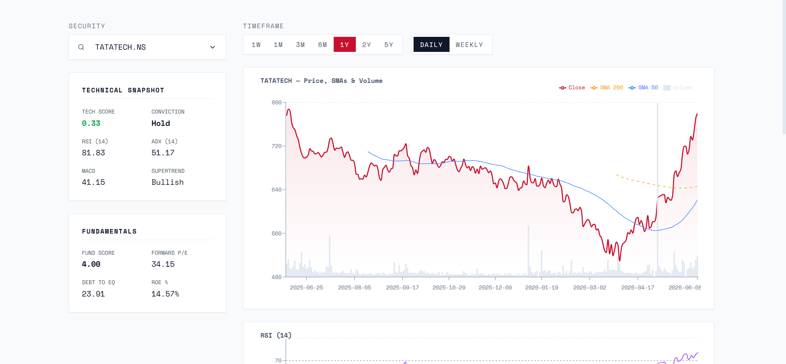

<div align="center">
  
  <br /><br />
  <p><strong>A research-backed quantitative stock recommendation system for the National Stock Exchange of India.</strong></p>
  <p>Engineered for the Alpha Research and Investment Club, FMS Delhi.</p>

  <br />

  [](https://github.com/abhy-kumar/quant-alpha/actions/workflows/daily_scan.yml)
  [](https://github.com/abhy-kumar/quant-alpha/commits/main)
  [](https://www.python.org/)
  [](https://react.dev/)
  [](./README.md#license)

  <br /><br />

  **[Live Dashboard](https://quant-alpha-sage.vercel.app)**&nbsp;&nbsp;&nbsp;**[Live Data API](https://quant-alpha-sage.vercel.app/api/live_data)**&nbsp;&nbsp;&nbsp;**[AI Summary (llms.txt)](https://quant-alpha-sage.vercel.app/llms.txt)**

</div>

<br />

<div align="center">
  
</div>

<br />


## Goal and Impact

Alpha is a fully automated stock screening and recommendation platform that evaluates the top 150 liquid equities on the National Stock Exchange of India (NSE) using a multi-factor model grounded in published academic research. The system eliminates emotional bias from equity research by applying systematic, rules-based scoring across three dimensions: technical momentum, fundamental quality, and research-backed quantitative factors.

The platform generates daily recommendations with conviction ratings (Strong Buy, Buy, Hold, Caution, Avoid) and stores all data in a growing SQLite database that accumulates daily feature vectors and forward return outcomes, forming the foundation for future machine learning model training.

## How It Works

The system operates as a dual-mode pipeline: a heavy batch scan runs three times daily via GitHub Actions (recomputing all scores and signals), while a lightweight live price overlay polls current prices every 3 minutes during market hours via Vercel serverless functions.

### Update Architecture

| Layer | Frequency | What Updates | Trigger |
|-------|-----------|--------------|---------|
| **Full Scan** | 3x daily (Mon-Fri) | All scores, signals, fundamentals, recommendations, market regime | GitHub Actions cron |
| **Live Prices** | Every 3 min (market hours) | LTP and 1D% change only | Browser polling `/api/live_data` |

The footer displays both timestamps independently: **Signals** (last scanner run) and **Prices** (last live overlay), so the freshness of each data layer is always visible.

### Batch Scan Pipeline

1. **Universe Selection** (`nse_fetcher.py`): Downloads the NSE Bhav Copy (official end-of-day data from NSE directly) and selects the top 150 stocks by turnover.
2. **OHLCV Fetching** (`data_fetcher.py`): Downloads 2 years of daily OHLCV data per stock via yfinance with retry logic and concurrency control (4 workers).
3. **Technical Indicator Computation** (`indicators.py`): Computes 18+ indicators per stock using Wilder's smoothing method for RSI, ATR, and ADX.
4. **Fundamental Data Collection** (`data_fetcher.py`): Fetches P/E, ROE, Debt-to-Equity, market cap, and other fundamentals from yfinance (primary), yfinance financial statements (secondary fallback), screener.in (tertiary fallback), and BSE India (last resort). Computes sector-relative medians for peer comparison. All financial figures are in INR.
5. **Research Factor Computation** (`research_factors.py`): Calculates ten academic research factors: Piotroski F-Score, Gross Profitability, Value Factor, Investment Factor, Earnings Momentum (SUE), Multi-Horizon Momentum, Low Volatility, Betting Against Beta, Mean Reversion, and Earnings Quality.
6. **News Sentiment** (`data_fetcher.py`): Fetches headlines from Google News RSS (India-locale: `hl=en-IN&gl=IN&ceid=IN:en`, no API key required) and runs VADER sentiment analysis on up to 10 headlines per ticker. The average compound score is the news sentiment signal. Scores are cached for 24 hours.
7. **Scoring and Conviction** (`scoring.py`): Combines all factors into a composite score, ranks stocks by percentile, and assigns conviction labels adjusted for market regime.
8. **Data Storage** (`data_pipeline.py`): Writes results to `market_data.json` (frontend), `market_scans.db` (ML pipeline), and archives to SQLite.
9. **Outcome Tracking** (`data_pipeline.py`): Backfills forward returns (5d, 10d, 21d, 63d, 126d, 252d) for all past scans using stored OHLCV data.

### Live Update Pipeline (/api/live_data)

- A Vercel serverless function called by the browser every 3 minutes during market hours (9:15 AM - 3:30 PM IST).
- Detects market hours using IST offset from UTC (UTC+5:30, no DST). Caches aggressively (6 hours) when market is closed.
- Updates only Price and 1D Change % in the React state. Does not write to disk or commit to the repository.
- Also fetches live NIFTY 50 for the header indicator.

## Scoring System

### Technical Score (range: -1.0 to +1.0)

A weighted ensemble of 14 binary signals. Each signal outputs +1 (bullish), -1 (bearish), or 0 (neutral). The weighted sum is normalized to produce a single score.

| Signal | Weight | Bullish Condition | Bearish Condition |
|--------|--------|-------------------|-------------------|
| Supertrend | 2.0 | Close above Supertrend line | Close below Supertrend line |
| Price vs SMA 200 | 2.0 | Close > SMA 200 | Close < SMA 200 |
| SMA 50 vs 200 | 2.0 | SMA 50 > SMA 200 (Golden Cross) | SMA 50 < SMA 200 (Death Cross) |
| ADX Trend Strength | 2.0 | ADX > 25 and +DI > -DI | ADX > 25 and -DI > +DI |
| Ichimoku Cloud | 1.5 | Close above both Span A and Span B | Close below both Span A and Span B |
| MACD Crossover | 1.0 | MACD > Signal Line | MACD < Signal Line |
| RSI (14-period) | 1.0 | RSI between 40-80 (bullish regime) or RSI < 30 | RSI > 70 |
| Volume Price Trend | 1.0 | VPT > 20-EMA of VPT | VPT < 20-EMA of VPT |
| Price vs SMA 50 | 1.0 | Close > SMA 50 | Close < SMA 50 |
| MACD Histogram | 0.5 | Current histogram > Previous histogram | Current histogram < Previous histogram |
| Stochastic Oscillator | 0.25 | %K < 20 and %K > %D | %K > 80 and %K < %D |
| Commodity Channel Index | 0.25 | CCI < -100 | CCI > 100 |
| Bollinger Bands %B | 0.25 | %B < 0.05 | %B > 0.95 |

Relative Strength percentiles provide an additional +/-0.2 adjustment for stocks in the top or bottom quartile.

News sentiment provides an additional **+/-1.0 adjustment** to the normalized technical score when the average VADER compound score exceeds +/-0.15 (lowered from +/-0.5 to ensure the signal actually fires in practice).

### Fundamental Score (range: 0 to 10)

Evaluates financial quality using sector-relative comparisons. The system dynamically computes sector medians for P/E, ROE, and Debt-to-Equity from the current universe plus screener.in peer data. All market cap and financial figures are in **INR Crores**.

| Metric | Max Points | Logic |
|--------|------------|-------|
| ROE | 1.5 | >= 1.5x sector median: 1.5 pts, >= sector median: 0.5 pts |
| ROCE | 1.5 | >= 20%: 1.5 pts, >= 12%: 0.5 pts |
| PEG Ratio | 2.0 | PEG < 1.0: 2.0 pts, PEG < 1.5: 1.0 pts (requires positive EPS growth) |
| Debt-to-Equity | 1.5 | < 0.8x sector median: 1.5 pts, < sector median: 0.5 pts |
| EPS Growth | 1.5 | > 15% YoY |
| Revenue Growth | 1.0 | > 10% YoY |
| Dividend Yield | 0.5 | > 1.0% |
| Market Cap | 1.0 | > Rs. 1,000 Crores |
| Sharpe Ratio | 1.0 | > 1.0 (computed using India 10Y G-Sec rate of 6.5% as risk-free rate) |
| Promoter Holding | 1.0 | > 50% holding and < 10% pledging |

Maximum score is capped at 10.0. A penalty of -1.5 is applied for promoter pledging above 30%.

### Research Factor Score (range: 0 to 10)

Ten academic factors, each normalized to 0-10 and combined with weights calibrated to the factor return literature:

| Factor | Weight | Paper | Range |
|--------|--------|-------|-------|
| Piotroski F-Score | 0.10 | Piotroski (2000) | 0-9 mapped to 0-10 |
| Gross Profitability | 0.10 | Novy-Marx (2013, JFE) | 0-10 |
| Earnings Quality | 0.10 | Sloan (1996) | 0-10 |
| Momentum Composite | 0.20 | Jegadeesh & Titman (1993) | -0.5 to +1.0 mapped to 0-10 |
| Value Factor | 0.15 | Fama & French (1993, JFE) | B/M, E/P, CF/P, D/P composite |
| Low Volatility | 0.10 | Baker, Bradley & Wurgler (2011, JF) | 0-10 (lower vol = higher score) |
| Betting Against Beta | 0.10 | Frazzini & Pedersen (2014, JFE) | 0-10 (lower beta = higher score) |
| Investment Factor | 0.10 | Titman, Wei & Xie (2004) | 0-10 (conservative investment) |
| Earnings Momentum (SUE) | 0.10 | Bernard & Thomas (1989, JAR) | 0-10 (positive surprise) |
| Mean Reversion | 0.05 | De Bondt & Thaler (1985) | 0-10 (oversold = higher score) |

The Value Factor is a multi-metric composite of Book-to-Market (Fama-French 1992), Earnings-to-Price (Basu 1977), Cash Flow-to-Price (Lakonishok et al. 1994), and Dividend Yield (Fama & French 1988). The Investment Factor rewards conservative capital allocation per Titman, Wei & Xie (2004) and the Fama-French 5-factor model.

### Composite Score and Conviction

The composite score blends all three dimensions with configurable weights. Each horizon uses a different blend - **Short-Term** emphasizes technical signals for timing, while **Long-Term** emphasizes value and quality factors:

| Variant | Tech | Fund | Research | Use Case |
|---------|------|------|----------|----------|
| **Balanced** | 0.35 | 0.30 | 0.35 | Default composite ranking |
| **Short-Term** | 0.50 | 0.15 | 0.35 | Technical timing, momentum trades |
| **Long-Term** | 0.10 | 0.40 | 0.50 | Value/quality investing, low turnover |
| **Momentum** | 0.20 | 0.10 | 0.70 | Research-driven momentum plays |

Cross-sectional percentile ranking: Instead of absolute thresholds, fund_score and research_composite are ranked against the full universe and mapped to a 0-10 scale via percentile-based piecewise functions. This ensures "good" scores adapt to market conditions rather than relying on fixed thresholds.

Stocks are ranked by composite percentile across the universe. Conviction labels are assigned and adjusted for market regime:

- Strong Buy: >= 90th percentile (or >= 85th in bullish regime)
- Buy: >= 70th percentile
- Hold: >= 40th percentile
- Caution: >= 20th percentile
- Avoid: < 20th percentile

Market regime adjustments downgrade conviction levels when the regime score is <= -2 (deep bear) or mildly bearish (-1).

## Market Regime Detection

A composite regime score ranging from -5 to +5 is computed from five India-specific signals:

1. Nifty 50 (`^NSEI`) position relative to its 200-day SMA (+1 or -1)
2. India VIX (`^INDIAVIX`) level: < 15 (+1), > 25 (-1)
3. FII/FPI net flow: > Rs.500 Cr net buy (+1), < Rs.500 Cr net sell (-1)
4. Put-Call Ratio (NIFTY options OI): > 1.2 bullish contrarian (+1), < 0.7 bearish (-1)
5. Market breadth (advances / total NSE stocks): > 0.55 (+1), < 0.45 (-1)

FII/DII data is sourced from NSE's `fiidiiTradeReact` API with a moneycontrol.com fallback. PCR is computed from NSE's option chain v3 API (`/api/option-chain-v3`). Both degrade gracefully to neutral (0) if unavailable.

## Technical Indicators

All indicators are computed using Wilder's exponential smoothing method for accuracy. The weekly Supertrend resamples daily data to `W-FRI` (NSE closes on Fridays).

- **RSI (14)**: Wilder-smoothed relative strength index
- **MACD**: EMA(12) - EMA(26), with 9-period signal line
- **Bollinger Bands**: 20-period SMA +/-2 standard deviations
- **Stochastic Oscillator**: 14-period %K and 3-period %D
- **ATR (14)**: Average True Range with Wilder's smoothing
- **ADX (14)**: Average Directional Index with +DI/-DI lines
- **Supertrend**: 10-period, 3x multiplier
- **Weekly Supertrend**: Resampled to weekly (W-FRI), direction mapped back to daily
- **VPT**: Volume Price Trend with 20-period EMA
- **Ichimoku Cloud**: Tenkan (9), Kijun (26), Span A, Span B (52)
- **CCI (20)**: Commodity Channel Index
- **VOL_MA20**: 20-day volume moving average

## Data Sources and India-Specific Handling

All data sources are evaluated for India-market correctness:

| Data | Source | Notes |
|------|---------|-------|
| Universe selection | NSE Bhav Copy (official) | Direct NSE download - authoritative |
| OHLCV prices | yfinance (`.NS` tickers) | INR-denominated, correct for NSE |
| Market cap | yfinance -> screener.in fallback | Stored as **INR Crores** (`/1e7`). Screener.in returns Crores directly; yfinance returns INR |
| P/E, ROE, D/E | yfinance -> screener.in fallback | Screener.in preferred - more reliable for Indian companies |
| Forward P/E | yfinance info -> screener.in analysis section | Used for SUE analyst revision proxy |
| Return on Assets | yfinance info -> yfinance balance_sheet -> screener.in #ratios | Three-layer fallback |
| Current Ratio | yfinance info -> screener.in #ratios | Used for Piotroski F-Score |
| Operating Cashflow | yfinance info -> yfinance cashflow statement -> screener.in P&L/Cash Flow | Three-layer fallback; critical for Value Factor CF/P |
| Revenue Growth | yfinance info -> yfinance quarterly_financials -> screener.in quarterly results | Three-layer fallback; critical for Investment Factor |
| Earnings Growth | yfinance info -> yfinance quarterly_financials -> screener.in quarterly results | Three-layer fallback; critical for Piotroski and SUE Factor |
| Gross Profits | yfinance info -> screener.in profit-loss table | Used for Gross Profitability factor |
| Sector / Industry | screener.in -> yfinance -> BSE India fallback | screener.in uses Indian sector taxonomy |
| Promoter holding / pledging | screener.in -> BSE India fallback | Not available in yfinance for Indian stocks |
| NIFTY 50 | `^NSEI` via yfinance | Correct |
| India VIX | `^INDIAVIX` via yfinance | Correct |
| FII/DII activity | NSE `fiidiiTradeReact` API -> moneycontrol.com fallback | Net buy/sell in INR Crores; degrades to neutral on failure |
| Put-Call Ratio | NSE option chain v3 API | NIFTY options OI; auto-resolves nearest expiry; degrades to 1.0 on failure |
| Market breadth | NSE Bhav Copy advance/decline | Correct |
| Risk-free rate | 6.5% (India 10Y G-Sec yield) | Correct for INR Sharpe calculation |
| News sentiment | Google News RSS (`gl=IN&hl=en-IN`) | India-locale, returns Moneycontrol/ET/BS headlines |

> **Note on screener.in**: The system gracefully degrades if screener.in is unavailable (rate limiting, timeouts). A 10-second timeout is used to account for GitHub Actions runner latency from US/EU datacenters to Indian servers. Each failure is logged with the HTTP status code or exception type so degradation is visible in scan logs.

## Data Storage

All data is stored in `data/market_scans.db` (SQLite) with the following tables:

| Table | Purpose | Growth Rate |
|-------|---------|-------------|
| `daily_ohlcv` | Raw OHLCV data per stock per day | ~70,000 rows per scan |
| `factor_history` | 62-column feature matrix per stock per scan | 149 rows per scan |
| `outcome_tracking` | Forward returns at 5d/10d/21d/63d/126d/252d | 149 rows per scan |
| `regime_history` | Market regime, Nifty level, breadth | 1 row per scan |
| `scan_summary` | Duration, coverage, top/bottom stocks | 1 row per scan |
| `historical_scans` | Full scan results with all 78 fields | 149 rows per scan |
| `live_prices` | Intraday price snapshots | ~149 rows per 3 minutes |

Outcome tracking automatically backfills forward returns for all past scans on each new run, creating a growing training dataset for machine learning.

## Machine Learning Query Functions

The `data_pipeline.py` module provides ready-to-use functions for ML workflows:

- `get_ml_dataset(min_date, max_date)` - Full feature+label DataFrame for model training
- `get_stock_timeseries(ticker)` - Per-stock factor history over time
- `get_regime_timeseries()` - Market regime evolution
- `get_outcome_accuracy(min_date)` - Win rate and average return by conviction level

## Architecture

```text
+-------------------------------------------------------------------------+
|                              DATA PIPELINE                              |
+-------------------------------------------------------------------------+
|  [nse_fetcher.py]                                                       |
|  1. Fetches top 150 NSE liquid stocks by turnover (Bhav Copy)          |
|         |                                                               |
|         v                                                               |
|  [scanner.py] (Orchestrator)                                            |
|  2. Delegates to data_fetcher.py for data acquisition                   |
|  3. Delegates to scoring.py for scoring logic                           |
|  4. Writes output to JSON and SQLite                                    |
|         |                                                               |
|         +-> [data_fetcher.py]                                           |
|         |    OHLCV, fundamentals (yfinance + statements + screener + BSE)|
|         |    News sentiment (VADER), ATH/ATL caching                    |
|         |                                                               |
|         +-> [indicators.py]                                             |
|         |    18+ indicators using Wilder's smoothing                    |
|         |    Weekly Supertrend resampled to W-FRI (NSE calendar)        |
|         |                                                               |
|         +-> [scoring.py]                                                |
|         |    Composite scoring, sector medians, conviction rating       |
|         |                                                               |
|         +-> [recommendation.py]                                         |
|         |    Tech Score (-1 to +1), Fund Score (0-10)                   |
|         |                                                               |
|         +-> [research_factors.py]                                       |
|         |    Piotroski, Gross Profit, Value, Investment, SUE,           |
|         |    Momentum, Volatility, Beta, Mean Reversion, EQ             |
|         |                                                               |
|         +-> [data_pipeline.py]                                          |
|              ML-ready storage: OHLCV, factors, outcomes, regime         |
|                                                                         |
|  5. Outputs to:                                                         |
|     - market_data.json (frontend static file)                           |
|     - market_scans.db (ML pipeline)                                     |
+-------------------------------------------------------------------------+
                   |
                   v (commit -> Vercel redeploy)
+-------------------------------------------------------------------------+
|                            FRONTEND (Vercel)                            |
+-------------------------------------------------------------------------+
|  React 19 + Vite + Tailwind + Recharts                                  |
|  - Loads market_data.json on page load (cache-busted)                  |
|  - Polls /api/live_data every 3 min during market hours (9:15-15:30)   |
|  - On-demand chart data via /api/chart (yahoo-finance2 v3)             |
|  - Footer shows: Signals updated (scan time) | Prices updated (live)   |
+-------------------------------------------------------------------------+
```

## Dashboard Features

The React frontend is a five-tab analytical dashboard:

| Tab | Description |
|-----|-------------|
| **Signals** | Top 3 high-conviction picks for Short-Term (momentum) or Long-Term (value/quality) horizon. Each card shows a horizon-specific composite score, Tech/Fund/Research sub-scores, key metrics (P/E, Mkt Cap, ROE, D/E, Sharpe, Beta), signal badges, and compact score bars (Piotroski, 12M Mom, Value, Vol 60D). |
| **Screen** | Full universe screener with sortable columns (Ticker, Sector, LTP, 1D%, Composite, Tech, Fund, Research, F-Score, 12M Mom, Value, Beta, P/E, Conviction). Dynamic filters for composite, Piotroski, Value Score, Beta, sector, conviction, market cap, and D/E. Expandable row shows 14 technical signals and all 10 research factors. |
| **Charts** | Interactive charting for any stock: Price + SMA 50/200 + Supertrend overlay, RSI (14), MACD (12,26,9). Left panel shows company profile, technicals, 10 research factors (Piotroski, Gross Profit, Earnings Quality, Value, Investment, SUE, Beta, Z-Score), momentum, fundamentals, and risk metrics (Vol, Sharpe, Max DD, Beta, Alpha). Sector peer comparison table with Value and Beta columns. |
| **Heatmap** | Color-coded sector heatmap where each tile represents a stock, colored from red (low composite) to green (high composite). Sectors sorted alphabetically. |
| **Factor Lab** | Conviction accuracy tracker showing historical win rates and average forward returns (21D and 63D) by conviction level, with a bar chart and summary cards. Data accumulates as scans age. |

### Header Bar

The header contains eight persistent indicators:

| Element | Description |
|---------|-------------|
| Logo | Alpha Research & Investment Club - theme-aware SVG |
| NIFTY chip | Live NIFTY 50 price and 1D% change, green/red coded |
| FII chip | FII/FPI net flow in INR Crores, green/red coded |
| DII chip | DII net flow in INR Crores, green/red coded |
| PCR chip | Put-Call Ratio, green (>1.2), red (<0.7), amber otherwise |
| Coverage chip | % of the 150-stock universe successfully scanned |
| Regime chip | Market regime (Bullish/Neutral/Bearish) with score, color-coded |
| Dark mode toggle | Switches between light and dark themes |

## Tech Stack

- **Frontend**: React 19, Vite 8, Tailwind CSS 3, Recharts 3, Lucide Icons
- **Data Engine**: Python 3.12, pandas, numpy, yfinance, BeautifulSoup4, vaderSentiment, feedparser, requests
- **News Source**: Google News RSS (`gl=IN&hl=en-IN&ceid=IN:en`) - India-locale, no API key required
- **Serverless API**: Vercel Functions (`api/chart.ts`, `api/live_data.ts`) - yahoo-finance2 v3 (class instantiation)
- **Analytics**: Vercel Analytics
- **Database**: SQLite (`market_scans.db`)
- **CI/CD**: GitHub Actions (three times daily: pre-open, mid-day, post-market scans)
- **Deployment**: Vercel (frontend + serverless), GitHub (data + backend)

### Frontend Component Map

```text
frontend/src/
├── App.tsx               # Global state, routing, data fetch, tab orchestration
│                         # Two separate timestamps: scanUpdated + pricesUpdated
├── types.ts              # TypeScript interfaces (DashboardData, MarketData, etc.)
├── index.css             # Design tokens, dark mode, glassmorphism, card system
└── components/
    ├── shared.tsx         # num(), colorCode(), scoreBar(), SortHeader()
    ├── SignalsTab.tsx      # High conviction signal cards with radar chart
    ├── ScreenerTab.tsx     # Full universe screener with filters + expandable rows
    ├── ChartingTab.tsx     # Price/RSI/MACD charts + company profile panel
    ├── HeatmapTab.tsx      # Sector heatmap with color legend
    └── FactorLabTab.tsx    # Conviction accuracy tracker with forward return charts
```

## Local Setup

### Prerequisites

- Python 3.12+
- Node.js 18+
- Git

### 1. Clone and Install

```bash
git clone https://github.com/abhy-kumar/quant-alpha.git
cd quant-alpha

# Python environment
python -m venv .venv
# Windows
.\.venv\Scripts\activate
# Unix/MacOS
source .venv/bin/activate

pip install -r requirements.txt

# Frontend
cd frontend
npm install
cd ..
```

### 2. Run the Scanner

```bash
python scanner.py
```

This downloads data for ~150 stocks (takes 2-3 minutes), computes all indicators and scores, and generates `frontend/public/market_data.json`.

### 3. Launch the Frontend

```bash
cd frontend
npm run dev
```

Navigate to `http://localhost:5173`.

### 4. (Optional) Run Tests

```bash
python -m unittest discover tests/ -v
```

## Configuration

All tunable parameters are in `config.py`:

| Parameter | Default | Description |
|-----------|---------|-------------|
| PERIOD | 2y | OHLCV history period |
| INTERVAL | 1d | OHLCV candle interval |
| MIN_ROWS | 50 | Minimum data rows per stock |
| MAX_WORKERS_OHLCV | 4 | Concurrent OHLCV download threads |
| MAX_WORKERS_FUNDAMENTALS | 2 | Concurrent fundamental fetch threads |
| CACHE_TTL_FUNDAMENTALS | 30 days | Fundamental data cache duration |
| CACHE_TTL_NEWS | 24 hours | News sentiment cache duration |
| CACHE_TTL_SECTOR | 90 days | Sector/industry mapping cache duration |
| CACHE_TTL_ATH | 90 days | All-time high cache duration |
| RISK_FREE_RATE | 0.065 | Risk-free rate for Sharpe ratio (India 10Y G-Sec) |

Screener.in circuit breaker settings are in `data_fetcher.py`:

| Parameter | Default | Description |
|-----------|---------|-------------|
| SCREENER_MAX_FAILURES | 10 | Max failures before disabling for 5 minutes |
| SCREENER_COOLDOWN | 300s | Cooldown period after circuit breaker trips |

## Project Structure

```text
stock-dashboard/
├── config.py                   # Configuration constants
├── scanner.py                  # Main orchestrator (batch scan)
├── data_fetcher.py             # Data acquisition layer (OHLCV, fundamentals, news)
├── scoring.py                  # Scoring logic (composite scores, conviction)
├── indicators.py               # Technical indicator computations
├── recommendation.py           # Scoring models (tech score, fund score)
├── research_factors.py         # Academic research factor implementations
├── data_pipeline.py            # ML-ready data storage layer
├── nse_fetcher.py              # NSE data sources (Bhav Copy, live quotes, FII/DII, PCR)
├── bse_fetcher.py              # BSE India fallback data
├── live_updater.py             # Intraday price updater (local use)
├── scheduler.py                # APScheduler background jobs (local use)
├── utils.py                    # Shared utilities and caching
├── generate_score_history.py   # Score history JSON for charting
├── populate_cache.py           # Cache pre-population script
├── populate_ath.py             # All-time high pre-population
├── check_db.py                 # Database inspection utility
├── requirements.txt            # Python dependencies
├── data/
│   ├── market_scans.db         # SQLite database (ML training data)
│   ├── sector_cache.json       # Sector/industry mappings (90-day TTL)
│   ├── fundamentals_cache.json # yfinance fundamental data cache (30-day TTL)
│   ├── news_cache.json         # Google News RSS sentiment cache (24-hour TTL)
│   ├── ath_cache.json          # All-time high cache (90-day TTL)
│   └── etf_list.json           # ETF exclusion list
├── frontend/
│   ├── api/
│   │   ├── chart.ts            # Vercel serverless: charting endpoint (yahoo-finance2 v3)
│   │   └── live_data.ts        # Vercel serverless: live pricing (yahoo-finance2 v3)
│   ├── public/
│   │   ├── market_data.json    # Generated scan output (committed by GitHub Actions)
│   │   ├── score_history.json  # Historical score data for charting
│   │   ├── logo-dark.svg       # Alpha logo for dark theme
│   │   └── logo-light.svg      # Alpha logo for light theme
│   ├── src/
│   │   ├── App.tsx             # Main dashboard application
│   │   ├── main.tsx            # React entry point
│   │   ├── types.ts            # TypeScript interfaces
│   │   ├── index.css           # Design tokens, dark mode, glassmorphism
│   │   └── components/         # Dashboard tab components
│   ├── package.json
│   └── vite.config.ts
├── .github/
│   └── workflows/
│       └── daily_scan.yml      # GitHub Actions: three-times-daily scan
├── tests/
│   ├── test_indicators.py      # Indicator unit tests
│   ├── test_scoring.py         # Scoring function tests
│   ├── test_research_factors.py # Research factor tests
│   └── test_e2e_recommendation.py # E2E pipeline tests
└── assets/                     # Logos and preview images
```

## GitHub Actions

The scanner runs automatically three times daily via GitHub Actions. All times are fixed-offset UTC+5:30 (IST has no DST).

| Cron | IST Time | Purpose |
|------|----------|---------|
| `30 3 * * 1-5` | 9:00 AM IST | Pre-open scan - fresh data before market opens |
| `0 7 * * 1-5` | 12:30 PM IST | Mid-day snapshot - intraday scoring |
| `45 10 * * 1-5` | 4:15 PM IST | Post-market scan - end-of-day signals (primary run) |

Each run pulls the latest database, runs the scanner, and commits the updated `market_data.json` and `market_scans.db` back to the repository with `[skip ci]` to avoid recursive triggers.

## Disclaimer

### General

This platform is provided strictly for educational and academic research purposes. It does not constitute, and should not be construed as, investment advice, a solicitation, or a recommendation to buy, sell, or hold any security or financial instrument.

### No Investment Advice

The quantitative models, scoring systems, signals, and conviction ratings generated by this platform are experimental in nature and have not been validated by any regulatory authority. They are based on historical data and academic research. Past performance is not indicative of future results. All investments carry risk, including the potential loss of principal. Users should not rely on any output from this platform as the sole basis for investment decisions.

### Third-Party Data Sources

This platform aggregates data from third-party sources including Yahoo Finance, screener.in, and Google News RSS feeds. The developers make no representations or warranties regarding the accuracy, completeness, or timeliness of data obtained from these sources. Data may contain errors, omissions, or delays. The developers are not affiliated with, endorsed by, or responsible for the operations of any third-party data provider.

### No Warranty

No representation or warranty is made as to the accuracy, completeness, or timeliness of the data, computations, or outputs provided by this platform. The developers and contributors assume no obligation to update any information and shall not be held liable for any errors, omissions, or inaccuracies in the data or analysis.

### Limitation of Liability

To the maximum extent permitted by applicable law, Alpha Research and Investment Club, FMS Delhi, its members, developers, and contributors accept no responsibility or liability for any direct, indirect, incidental, consequential, or punitive damages, losses, or costs arising from the use of or reliance on this platform, including but not limited to trading losses, investment losses, or loss of data.

### User Responsibility

Users should conduct their own due diligence and consult a SEBI-registered investment advisor or certified financial planner before making any investment decisions. By accessing this platform, you acknowledge that you have read, understood, and agreed to this disclaimer, and that you are solely responsible for any investment decisions you make based on the outputs of this platform.

### Governing Law

This disclaimer shall be governed by and construed in accordance with the laws of India. Any disputes arising from the use of this platform shall be subject to the exclusive jurisdiction of the courts in Delhi, India.

### Severability

If any provision of this disclaimer is held to be invalid or unenforceable, the remaining provisions shall continue in full force and effect.

### Contact

For questions regarding this disclaimer, contact: Alpha Research and Investment Club, Faculty of Management Studies, University of Delhi.

---

## Cite This Project

If you use Alpha's data, methodology, or code in academic work, please cite:

```bibtex
@software{kumar2024alpha,
  author    = {Kumar, Abhishek},
  title     = {Alpha: A Multi-Factor Quantitative Stock Recommendation System for the NSE},
  year      = {2024},
  url       = {https://github.com/abhy-kumar/quant-alpha},
  note      = {Alpha Research and Investment Club, Faculty of Management Studies, University of Delhi}
}
```

## Topics

`quantitative-finance` · `nse-india` · `factor-investing` · `algorithmic-trading` · `piotroski-f-score` · `stock-screener` · `react` · `python` · `fms-delhi` · `machine-learning`

---

## License

This project is proprietary software developed for the Alpha Research and Investment Club, FMS Delhi. All rights reserved.

## Copyright

Copyright (c) 2024-2026 Abhishek Kumar. All rights reserved.

Developed by Abhishek Kumar
